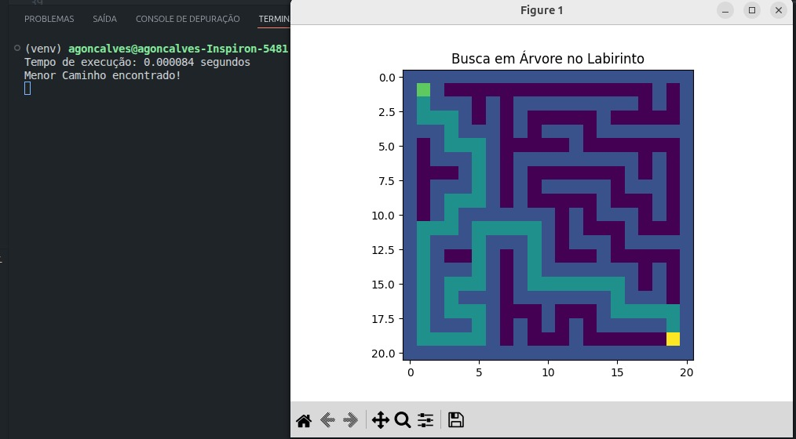

# G13_Grafos_PA-26.1

# Labirinto com Geração em DFS e Busca em BFS

Este projeto implementa a geração de um labirinto aleatório e a busca de caminho em Python. A construção do labirinto usa **DFS (Depth-First Search)** com backtracking, enquanto a procura pelo menor caminho usa **BFS (Breadth-First Search)**. O projeto também inclui visualização gráfica do labirinto e do caminho encontrado com **matplotlib**.

## Alunos
- Amanda Gonçalves Sobrinho Abreu (211030925)
- Arthur Rodrigues Sousa (211030291)

## Funcionalidades

- Geração de labirinto aleatório
- Algoritmo de busca BFS para encontrar o menor caminho
- Visualização gráfica do labirinto
- Marcação do caminho encontrado
- Medição do tempo de execução do algoritmo

### Geração do labirinto
- Algoritmo: **DFS com backtracking**
- Funcionamento: a função parte de uma célula inicial, escolhe direções aleatórias e avança recursivamente para células ainda não visitadas, voltando apenas quando não há mais movimentos possíveis
- Característica: gera um labirinto perfeito, isto é, sem ciclos e sem áreas isoladas

### Busca de caminho
- Algoritmo: **BFS (Breadth-First Search)**
- Funcionamento: a busca explora o labirinto por camadas a partir da origem, registrando predecessores para reconstruir o caminho final
- Garantia: encontra o menor caminho em número de passos

## Requisitos

- Python 3.x
- Biblioteca matplotlib

Instalação:

```bash
pip install matplotlib
```

## Execução

```bash
python labirinto_bfs.py
```

## Saída


